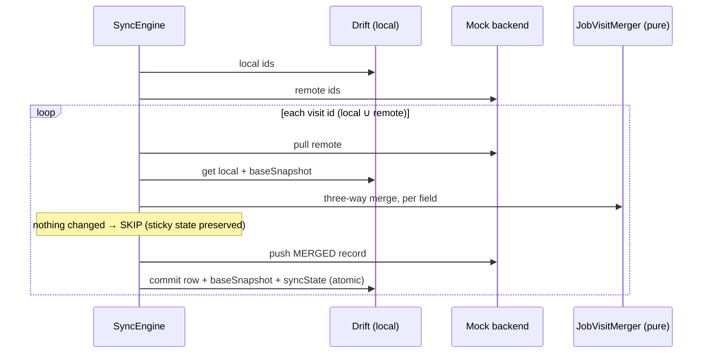

# FieldOps

Offline-first field operations app for a field technician — create and edit Job
Visits with **no network**, sync them to a mock backend when connectivity
returns, and resolve conflicts **per field, not per record**, using a
hand-written three-way merge against the last-synced baseline. Native background
location tracking records a per-visit GPS trail (a real Android foreground
service; Swift `CLLocationManager` on iOS), and visit photos sit behind a
biometric/device-credential gate. This is a take-home build for a Flutter
developer assessment — the sync/merge layer, native location handling, and
deep-link/notification plumbing are all implemented from scratch to show
engineering judgment, not SDK wiring.

| Link | What it is |
|---|---|
| [`release/fieldops.apk`](release/fieldops.apk) | Installable APK (release build, debug-signed) — install without building |
| [`doc/architecture.md`](doc/architecture.md) | The deep dive: merge `_decide` logic, sync protocol, notification/deep-link chain, native location — with Mermaid diagrams |
| Video walkthrough | _link to be added_ |

---

## Status at a glance

| Requirement | Status | Verified on |
|---|---|---|
| Offline create/edit + mock-backend sync | ✅ | Unit + engine tests; live emulator |
| Per-field merge, both changes survive | ✅ | 8-case merge suite + engine-level test (f); live conflict demo |
| Sync-state indicator (pending / synced / conflict resolved) | ✅ | Widget tests, both sort modes; live + verified sticky |
| Resumable mid-batch failure | ✅ | Engine test; live fail-after-N demo |
| Biometric photo gate + passcode fallback | ✅ | Android physical-device manual (incl. the PIN-only fallback case) |
| Push-style notification + cold-start deep link | ✅ | Live emulator (warm tap + killed-app tap) |
| Custom-scheme deep link (running + cold) | ✅ | Live emulator (+ the warm-link bug it exposed, fixed) |
| System-driven theming, live switch | ✅ | Live emulator, pixel-verified both directions |
| **Android** background location FGS | ✅ | Live emulator API 36: ticks, screen-locked delivery, stop, crash-fix |
| **iOS** native background location | ⚙️ **Coded, unbuilt/unverified — see below** | — |

**The iOS caveat, stated plainly.** The Swift `CLLocationManager` handler
(`allowsBackgroundLocationUpdates`, the When-In-Use → Always downgrade surface,
background mode + `NSLocationAlwaysAndWhenInUseUsageDescription`) is written and
reviewed, and its shared Dart side is verified on Android. It has **not** been
compiled or run because this environment has no macOS toolchain or iOS device.
The Android side exercises the same Dart contract end to end; iOS needs a
`flutter build ios` + simulator/device pass. Android-only verification is valid
for platform-agnostic features (theming), but not for un-compiled Swift — so the
iOS location checkbox stays honest-pending.

---

## Install & run

**Fastest — the APK.** Install `release/fieldops.apk` on an Android device
or emulator (USB debugging or drag-and-drop):

```
adb install -r release/fieldops.apk
```

**Or run from source:**

```
flutter pub get
flutter run          # any attached device/emulator
```

First-run notes:
- **Notifications:** Android 13+ shows a `POST_NOTIFICATIONS` prompt *after* the
  first frame (deliberately — it must not block the launch screen). Without the
  grant, status-change notifications are silently dropped.
- **Location:** the track-location toggle requests While-In-Use first, then the
  Android 10+ "Allow all the time" upgrade for screen-locked ticks. Denying the
  upgrade still tracks (foreground only).
- **Biometrics:** the photo viewer gate needs a device biometric or passcode
  enrolled. On the iOS simulator, enroll Face ID via Features → Face ID before
  recording.

---

## Demo script

Everything below runs on ONE Android device/emulator using the in-app **Debug
Menu** (the bug-report icon, top-right) — the mock backend makes "two devices"
a single-device demo.

**Two rules that make the script deterministic (learn them once, they're the
whole trick):**
- **Every step begins by stating its connectivity state.** While the toggle is
  **Offline**, nothing syncs — edits sit *Pending* and Device-B writes stay in
  the backend. Flipping **Online** is the sync trigger.
- **Device B's writes are deliberately stamped +5 seconds.** This is what makes
  same-window conflicts resolve deterministically: the Device-B debug write uses
  a future timestamp so it "happens after" your current edit. Any step where
  **your** edit must win requires you to make it **at least 6 seconds after** the
  Device-B write.

**1. Two-field offline conflict → both survive.**
Flip Online **OFF**. Create a visit → on its detail screen edit the **status**
(it stays *Pending* — autoSync only runs while online). Debug Menu → "Simulate
Device B edit" → pick this visit + **photo**, write it. Flip Online **ON**.
Expect: the visit is *Synced*, the detail shows the new status **and** the photo
path from "Device B" — both changes survived (different fields, no conflict).
The sync log narrates it line by line.

**2. Sticky `conflict_resolved`.**
Flip Online **OFF**. Both sides edit the **same** field (status): first run
"Simulate Device B edit" → status → pick a value, write it. **Wait ≥6 seconds**,
then make your own status edit on the detail screen (different value) — your
timestamp is now ahead of Device B's (rule above; without the wait, B's
+5s-stamped write wins instead). Flip Online **ON**. Expect the status-change
notification is **suppressed** (your local edit won — "nothing changed from your
point of view", gate 3) and the row shows *Conflict resolved* **and stays that
way** across the next no-op sync (the sticky rule — it can't revert). Verifiable
in the widget tests.

**3. Resumable mid-batch failure.**
Flip Online **OFF**. Create **three** visits — all stay *Pending* (they are this
step's own batch, so the injection actually has rows to hit). Debug Menu →
"Fail sync after N records" → Arm N=2. Flip Online **ON**: the engine commits
two, throws on the third, the SnackBar reports the failure and the app stays
responsive. Debug Menu → Disarm → flip OFF then ON → only the still-*Pending*
visit retries ("1 visit synced").

**4. Biometric photo gate.** (no connectivity involved)
Detail → tap the locked photo → biometric/device prompt runs *inside* the photo
viewer (the locked placeholder walks every entry path, including deep links) →
unlock shows the image. Lock-themed failure states (no passcode configured, too
many attempts) each render a distinct message — never a crash.

**5. Status-change notification + cold-start tap.**
Flip Online **OFF**. Debug Menu → "Backend changes status" → write. Flip Online
**ON**. Expect a **"Job Visit status changed / On Site → Completed"**
notification. Tap it (app alive) → detail screen. The hard case: let it post,
then `adb shell am crash com.fieldops.app` (a crash kills the process *without*
the stopped-state that `force-stop` imposes, so the notification tap still
cold-launches the app via the launch-details path and routes to the visit) → tap
the notification → app cold-starts directly onto that visit's detail.

**6. Deep link.** (no connectivity involved)
```
adb shell am start -a android.intent.action.VIEW -d "fieldops://visit/<VISIT_ID>"
```
Warm (app open) and cold (`am force-stop` first) both open that visit. A bogus id
lands on "Visit not found" — never a crash. (A real id is visible in the
developer log or `adb exec-out run-as com.fieldops.app cat files/mock_backend.json`.)

**7. Live theme switch.** (no connectivity involved)
With the app foregrounded: `adb shell cmd uimode night yes` / `no` — the whole
UI re-themes instantly, no restart.

---

## Architecture

The sync protocol is **pull → merge → push, executed per visit** — never two
batch phases, because push-before-pull silently destroys the other side's edit
before a merge can see it:



- **Presentation** keeps the DB and backend behind Riverpod providers; **domain**
  entities/usecases are pure Dart (drift-free, testable without a database);
  **data** owns the merge, engine, and persistence.
- Conflicts are detected **against the last-synced `baseSnapshot`**, per field —
  a raw two-way timestamp comparison can pick a winner but can't *detect* a
  conflict, which is what the brief requires.
- Everything else — the `_decide` LWW branch order, the notification gates, the
  native location pipeline — is in [`doc/architecture.md`](doc/architecture.md).

---

## Key technical decisions

### State management — Riverpod
Not "what I always use": compile-safe provider-based DI with override seams the
widget tests exploit (a fake token provider, a fake backend, a clean test
router). The enforced principle: **the database is the state** — screens consume
Drift `watch()` streams (`AsyncValue`), and notifiers own only *ephemeral* UI
state (the create-form autosave draft). Two devices can't disagree because
there's exactly one source of truth.

### Persistence — Drift
vs **sqflite** (untyped SQL strings, manual rows) and **Hive/Isar** (no reactive
SQL queries). Drift gives compile-checked typed queries and `watch()` streams
that *are* the list UI and the sync-state indicator, a schema reviewers can read
(`tables.dart`), and real migrations. Timestamps are stored as **int
milliseconds since epoch**, not `DateTime`, because Drift's `DateTime` column
can lose sub-second precision — and the whole merge depends on precise
changed-detection for edits made seconds apart.

### Secure token storage — `flutter_secure_storage`, under the hood
The mock-sync auth token is persisted with this package, and — to keep the
requirement real rather than decorative — `MockSyncService` actually reads it
back out and attaches it (`Bearer …`) to every fake request; the backend throws
without it, so every green sync is live evidence the token round-trips.
**Android:** the encryption key is generated and held in the Android Keystore
(hardware-backed where StrongBox/TEE exist); the plugin's current versions wrap
Jetpack **EncryptedSharedPreferences/EncryptedFile (AES-256-GCM)**, so the token
is never plaintext on disk. Uninstall clears it. **iOS:** items go to the system
**Keychain** (`SecItemAdd`/`SecItemCopyMatching`) with accessibility attributes
(default: unlocked-device-only), guarded by the Secure Enclave + passcode — and
Keychain items **survive app reinstall**, a real behavioral difference from
Android.

### Biometric photo gate — `local_auth`, under the hood
**Android:** wraps `androidx.biometric`'s **`BiometricPrompt`** (system UI,
authenticates against device-enrolled biometrics); `biometricOnly: false` admits
the device-credential fallback (PIN/pattern/password). This is why `MainActivity`
extends `FlutterFragmentActivity` — the prompt misbehaves without it. **iOS:**
`LAContext.evaluatePolicy` with `.deviceOwnerAuthentication` (biometrics *or*
passcode) vs `.deviceOwnerAuthenticationWithBiometrics`; the gate deliberately
**does not** gate on `canCheckBiometrics()`, which returns false on Android when
no biometric is *enrolled* even with a PIN set — gating on it would silently kill
the passcode fallback the brief requires. `LAError` codes (`biometryNotEnrolled`,
`passcodeNotSet`) map to distinct UI states (a "set up a screen lock" surface,
lockout messages), and `NSFaceIDUsageDescription` covers iOS.

---

## Platform edge cases

**Featured — the `START_STICKY` restart crash (Android 12+).** *Symptom:* the
app crashed on reinstall / after process death while location tracking ran.
*Root cause:* a `START_STICKY` service is auto-restarted by the OS with a **null
intent**; calling `startForeground()` for a location-type foreground service
from that background restart throws `SecurityException` (the background
FGS-start restriction) — uncaught, it killed the whole process. *Fix:* guard the
null-intent restart and stop cleanly instead of re-entering foreground blind,
use unconditional `START_NOT_STICKY`, and wrap `startForeground` in `try/catch`
so any failure degrades to stopped rather than crash. *How it was found:* live
testing captured the reinstall crash; review alone wouldn't have — this is why
Phase 9's placeholder was built and exercised, not just written.

**Secondary one-liners.**
- `canCheckBiometrics()` vs the passcode fallback — see the gate explanation
  above (a stealth passcode-killer).
- Android 13 `POST_NOTIFICATIONS` drops notifications **silently** (no error,
  nothing appears) — the permission request is a Phase-8-only concern, and a
  missing first-run grant looks exactly like a broken notification path.
- The go_router **warm deep-link "Page Not Found"** — the engine hands the raw
  `fieldops://` URI to the router; a `redirect` canonicalizes it (the full
  analysis is in `doc/architecture.md` §8).

---

## Trade-offs & known limitations

Honest accounting of what a tight deadline (and one platform absent) costs:

- **iOS native location is written but unbuilt/unverified** (no Mac toolchain) —
  the biggest honest gap; the Dart contract it consumes is proven on Android.
- **Mock photo paths across simulated devices**: a photo's `photoPath` is a local
  file path, meaningless once "moved" to another simulated device — the gate
  viewer renders a "Photo file not available on this device" state instead of a
  broken image. Fine for a mock sync layer; called out, not hidden.
- **Wall-clock LWW assumes synchronized clocks.** The conflict resolution trusts
  per-field timestamps; two devices with skewed clocks would mis-order. The
  honest fix is hybrid logical clocks or server-side ordering.
- **`deviceId` is record-level**, not per-field — it approximates "last writing
  device" for the tie-break. And the local device id is hard-coded `device-a`
  (adequate for the two-device simulation on one handset).
- **The debug online/offline toggle *is* connectivity** — there is no real
  network. That's deliberate and matches the brief ("simulated via a toggle").
- **Documented mid-sync edit race**: a local edit landing between pull and
  commit for the same visit converges on re-merge but can surface a phantom
  `conflict_resolved`; acknowledged as not demo-reachable with the current
  injection and left as a known edge.
- Background tracking toggle vs Activity death: if the Activity is destroyed
  while the foreground service runs (rare OEM swipe-away paths), the fresh
  controller can show Idle while ticks keep flowing into `LocationPoints` — data
  stays correct, only the control lies (documented in the code).

---

## Testing

| Level | What it covers |
|---|---|
| **Merge unit** | All eight cases (a)–(h) from the brief, tie-break both directions, no-op re-pull, null-input guard |
| **Engine-level** | Real sync engine + fake backend + real Drift DB: case (f) both edits survive, sticky state, first-push, remote-create, mid-batch failure + resumable retry, single-flight, auth, corruption quarantine |
| **Widget** | Sync-state indicator (three states, both sort modes), create-visit flow (with/without GPS) |
| **Live** | The demo script above doubles as an unassisted repro (deep links, notifications, failure injection, location ticks) and was exercised on an emulator |

Run: `flutter test` (57 tests) then `flutter analyze`.

---

## What I'd change with more time

1. **Hybrid logical clocks / server-side ordering** instead of wall-clock LWW —
   the least-confident part of the design.
2. **Real two-device testing** (two handsets) rather than the single-device
   simulation.
3. **Per-field `deviceId`** so the tie-break reflects the actual writer of each
   field.
4. **Retry with backoff** in the sync engine, and a `getState` channel query to
   close the toggle-vs-Activity-death desync.