# FieldOps — Architecture (Phases 0–10)

> How the app stores data, how a Job Visit travels from creation through offline
> editing to sync, and — crucially — how the field-level merge actually works,
> plus the notification/deep-link layer (Phase 8) and native background-location
> tracking (Phases 9–10).
> Diagrams are Mermaid. Companion text: the README's "Key technical decisions"
> and "Platform edge cases" sections; decisions/why and the per-phase
> execution checklist were maintained in an internal planning folder and are
> intentionally not part of this repo.

---

## 1. Big Picture — what the app is

FieldOps is an **offline-first** field-operation app: a technician creates and
edits Job Visits with **no network**, and those edits reach a **mock backend**
(a JSON file on disk) the next time "connectivity" is restored. The interesting
part is that _two_ devices can edit the _same_ visit offline, and the conflict
is resolved **per field** (not per record) using a **three-way merge against the
last-synced baseline**.

The whole sync/merge layer is **hand-written** — no offline-sync SDK, no CRDT
library. Per the brief, this is the single most evaluated part of the assessment.

### 1.1 Layered architecture (Clean Architecture)

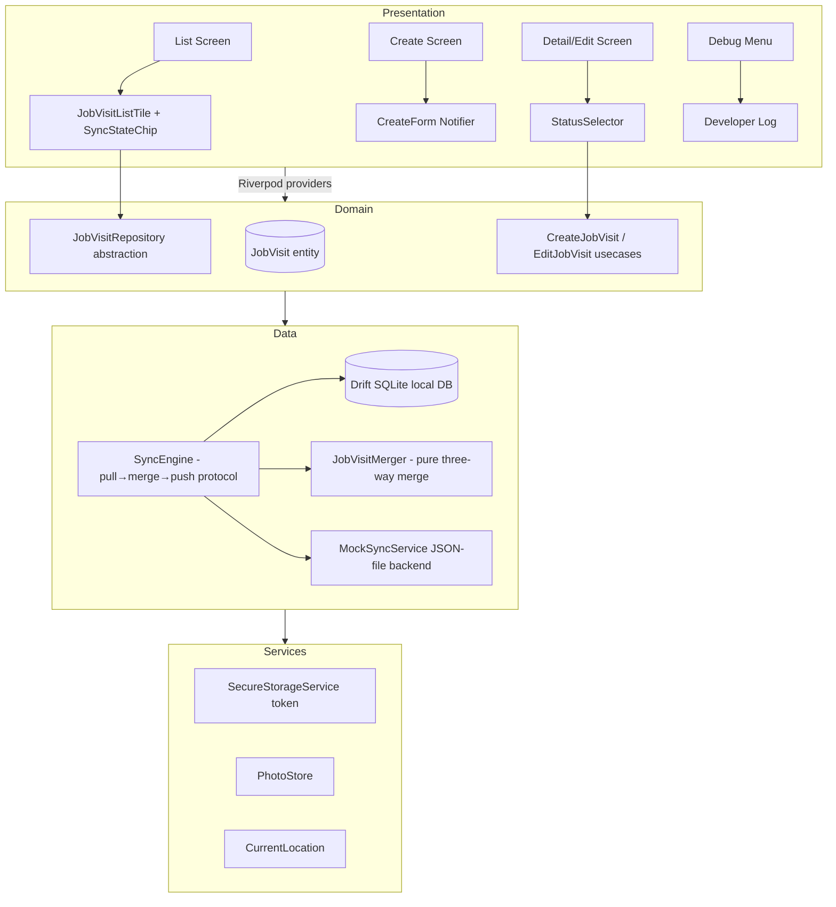

- **Presentation** never touches Drift or the backend directly.
- **Domain** entities/usecases are pure Dart (the `JobVisit` entity has zero
  Drift annotations, so tests never need the database).
- **Data** owns the merge, the engine, and both persistence roots.
- **Services** wrap platform channels (secure storage, photos, GPS).

---

## 2. How data is stored

### 2.1 Local DB (Drift / SQLite)

Two tables, with the schema below:

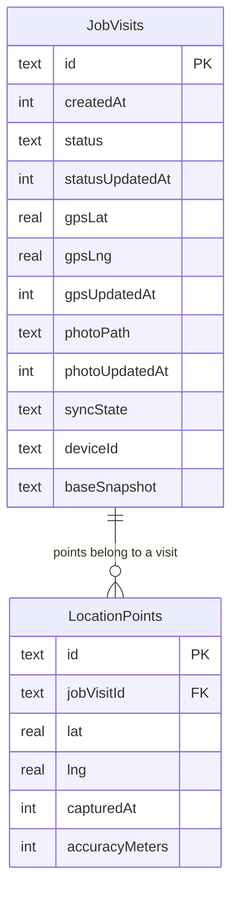

Key choices (each is load-bearing):

- **`*UpdatedAt` are `int` milliseconds since epoch**, never `DateTime` — Drift's
  `DateTime` column can lose sub-second precision, and the debug demo edits
  seconds apart. Milliseconds is exact; it's what makes changed-detection
  reliable (`local.updatedAt != base.updatedAt`).
- **`baseSnapshot` is a JSON string** capturing per-field values + timestamps as
  of the last successful sync. It is the _baseline_ for the three-way merge.
  `null` until the first sync completes.
- **`syncState`** is the single source of truth (`pending | synced |
  conflict_resolved`). There is deliberately **no `isDirty` flag** — "pending"
  _is_ the dirty state.
- **`LocationPoints` is a separate table** — background GPS ticks write here,
  NOT onto the JobVisit row. If `gpsUpdatedAt` moved every few seconds, every
  sync would misdetect a conflict.
- **`deviceId`** records which device made the last local edit; it is the
  merge's deterministic tie-breaker ("lexically smaller wins").

### 2.2 `baseSnapshot` shape

```jsonc
{
  // per-field: the *value* plus the *edit timestamp* as of last successful sync
  "status": { "value": "onSite", "updatedAt": 1000 },
  "gps": { "lat": 1.0, "lng": 2.0, "updatedAt": 1000 },
  "photo": { "path": "/photos/a.jpg", "updatedAt": 1000 },
}
```

Serialization lives in `data/models/base_snapshot.dart`; the wire/backend codec
in `data/models/job_visit_json.dart`.

### 2.3 Mock backend (remote side)

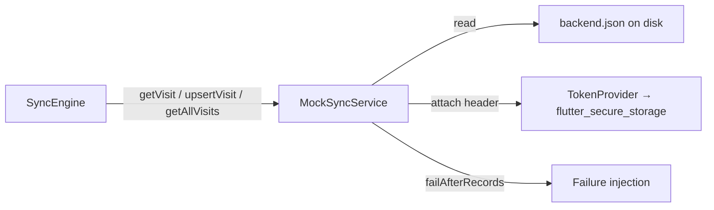

- `MockSyncService` is **JSON-file-backed** — records survive app restarts (the
  presence of a _file_ makes the cold-start and two-device demos convincing).
- Every fake request **attaches the auth token** read back out of
  `flutter_secure_storage` (Keystore/Keychain) — real, not decorative.
- Writes are **atomic** (temp file + rename) and corrupt files are
  **quarantined** to `backend.json.corrupt` rather than silently wiping history.
- The token provider is **injected** — the app wires secure storage; tests wire
  a fake (the platform channel can't run in a pure-Dart engine test).

---

## 3. The lifecycle of a Job Visit

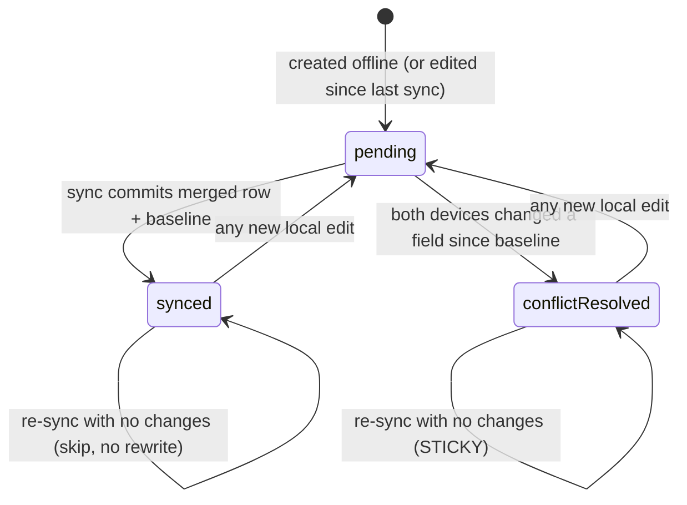

**The sticky rule (reviewer-grade, enforced two places):**

1. _UI/Edit layer_ — every create/edit forces `syncState = pending`, regardless
   of prior state (`CreateJobVisit` / `EditJobVisit`).
2. _Engine layer_ — the merge result reports `participated`. A visit that did
   **not** participate in a round (nothing changed on either side since
   baseline) is **skipped entirely, never rewritten**, so a `conflict_resolved`
   flag does **not** silently flip back to `synced` on the next unrelated sync.

---

## 4. The sync run — end to end

### 4.1 Sequence diagram (one sync round, one visit)

The protocol is **pull → merge → push**, executed **per visit**, never as two
separate batch phases.

```mermaid
sequenceDiagram
    autonumber
    participant UI as Debug menu / auto-sync
    participant ENG as SyncEngine
    participant REPO as Drift repository (local)
    participant B as Mock backend (JSON)
    participant MERGE as JobVisitMerger (pure)

    UI->>ENG: sync()  [single-flight guard: one run at a time]
    ENG->>REPO: getAll() → local visit ids
    ENG->>B: getAllVisits() → remote visit ids
    Note over ENG: id set = local ∪ remote (sorted)
    ENG->>B: getVisit(id)  [pull]
    ENG->>REPO: getById(id)  [local row]
    ENG->>MERGE: merge(local, remote)
    alt not participated (nothing changed since baseline)
        Note over ENG: SKIP — no push, no local write (sticky state preserved)
    else participated
        ENG->>B: upsertVisit(merged)  [push the MERGED record, not raw local]
        alt backend accepts
            ENG->>REPO: upsert(merged)  [row + baseSnapshot + syncState in ONE transaction]
        else backend throws (e.g. fail-after-N injection)
            Note over ENG: commit nothing — visit stays pending; resumable next run
        end
    end
```

### 4.2 Why push-after-merge (the bug this ordering prevents)

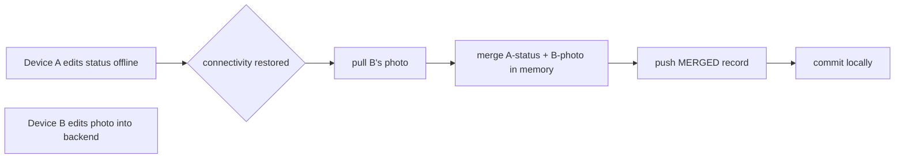

If the engine pushed **raw local** state first, A's stale copy (which never saw
B's photo) would overwrite the backend's photo **before the merge ever saw it** —
the brief's headline "both changes should survive" would fail with every merge
unit test still green. Push-first is a classic _orchestration_ bug the
engine-level test specifically guards against.

### 4.3 The merge decision (baseSnapshot three-way, per field)

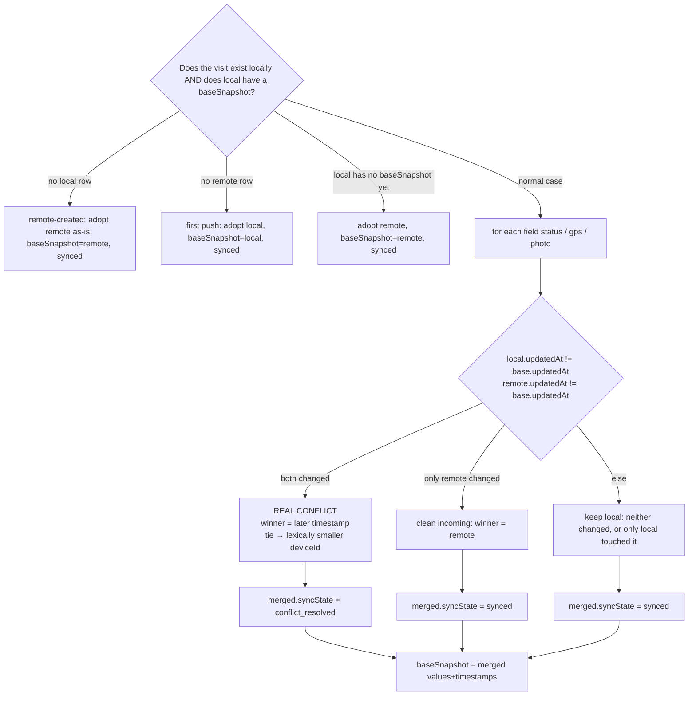

Tests cover all eight cases (a)–(h) plus tie-break both directions and the
participated/no-op guards.

### 4.4 The `_decide` LWW core — per field, exact branch order

This is the heart of `JobVisitMerger._decide`: one execution per field
(status/gps/photo), and the branch order is load-bearing.

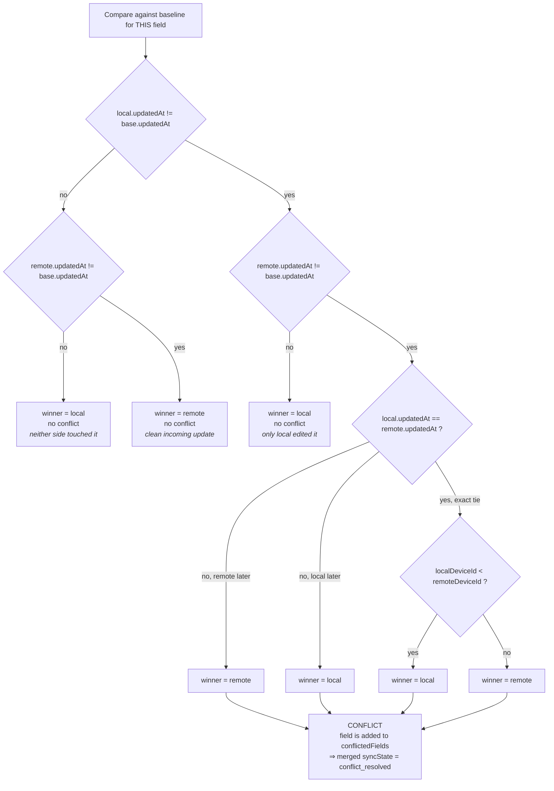

Key invariants encoded in that order:

- **Tie-break is that final diamond, never reached on a same-side comparison.**
  `local.updatedAt == remote.updatedAt` only matters when _both_ sides changed
  since the baseline — a two-way timestamp comparison can pick a winner, but it
  cannot _detect_ the conflict. The `participated` / conflict detection comes
  from the baseline comparison (`A` + `C`), the resolution comes from `L`/`T`.
- **Lexically smaller `deviceId` wins a tie** (`localDeviceId.compareTo(remoteDeviceId)
  <= 0`), deterministically, and it is tested from _both_ directions.
- **Null timestamps are handled:** in the conflict branch, `(localUpdatedAt ?? 0) >
  (remoteUpdatedAt ?? 0)` — a side that never touched the field can't win LWW.

---

## 5. Developer log — how the sync narrates itself

Every step the engine actually takes is emitted through an optional `onEvent`
sink and rendered in the debug menu's **Developer log** panel (timestamped,
monospace, newest at the bottom):

```
12:03:41.912  sync run: 3 visit(s) on watch: a, b, c
12:03:41.914    [a] pull: remote found · local: present
12:03:41.915    [a] merge: clean — local changed status · remote changed photo since baseline
12:03:41.917    [a] push: merged record accepted by backend
12:03:41.918    [a] commit: row + baseSnapshot + syncState=synced (one local transaction)
12:03:41.919    [b] pull: no remote record · local: present
12:03:41.920    [b] merge: no-baseline branch → adopt the only existing side
12:03:41.922    [b] push: merged record accepted by backend
12:03:41.923    [b] commit: row + baseSnapshot + syncState=synced
12:03:41.924    [c] skip: neither side changed since baseline — state preserved
12:03:41.925  sync run: done — 2 visit(s) synced
```

This makes the demo **self-narrating**: the log literal description of the
engine's pull → merge → push → commit loop, live on camera.

---

## 6. Phase-by-phase build walkthrough (0 → 10)

Phases 0–4 are the deep-dived data + sync work below. Phase 8 has its own
section §8, Phases 9–10 §9; the built state and verification evidence for every
phase are summarized in the README. Phases 5–7 and 11 were pure live-verification
phases (the conflict/fail-injection demos, the biometric gate, and system-theme
switching) — their evidence sits in the README's demo script and status table.

### Phase 0 — Bootstrap

- **What:** Flutter project with package id `com.fieldops.app`; Riverpod,
  go_router, Drift + drift_dev/build_runner, drift_flutter,
  flutter_secure_storage, local_auth, flutter_local_notifications, app_links,
  image_picker, geolocator, uuid, intl.
- **Structure:** Clean Architecture folder skeleton
  (`core/{di,router,theme,utils,widgets}`, `features/job_visit/{domain,data,presentation}`,
  `services/`).
- **Why:** each feature folder is self-contained so "40+ screens / team of 5"
  doesn't touch existing code when a screen is added.

### Phase 1 — Data layer

- **What:** `JobVisits` + `LocationPoints` Drift tables exactly per §3;
  `JobVisit` pure-Dart entity with `JobVisitStatus` (`enRoute | onSite |
  completed | blocked`) and `JobVisitSyncState`; int-ms timestamps; no `isDirty`.
- **Key discipline:** the domain entity never imports Drift — the merge engine
  (Phase 3) is testable with zero database.

### Phase 2 — Repository + local CRUD + base UI

- **What:** `JobVisitRepository` (abstract) → `JobVisitRepositoryImpl` (Drift);
  `CreateJobVisit` / `EditJobVisit` usecases that own the discipline
  (**stamp `*UpdatedAt`, force `pending`, record `deviceId`**); list / create /
  detail screens; shared widgets (`SyncStateChip`, `StatusChip`,
  `StatusSelector`, `JobVisitListTile`, `LockedPhotoPlaceholder`, `EmptyState`);
  photo via `image_picker` (gallery only) persisted by `PhotoStore` into
  `<documents>/photos/`; GPS auto-captured at creation (degrades to null).
- **Result:** create → edit → persist fully offline, proven by repo tests.

### Phase 3 — Merge engine (isolated)

- **What:** pure `JobVisitMerger` + `BaseSnapshot` codec, with **zero**
  Drift/sync/UI dependencies. All no-baseline branches (first push, remote-
  created, first pull) handled _inside_ the merger. Tie-break: smaller
  `deviceId` wins on exact timestamp ties. Result carries `conflictedFields`,
  `localChangedFields`, `remoteChangedFields`, and `participated`.
- **Tests:** all eight client cases (a)–(h), tie-break both directions,
  no-op re-pull → `participated == false`, null/null → clear ArgumentError.

### Phase 4 — Mock backend + sync engine + debug menu

- **What:** `MockSyncService` (JSON file, token-provider injected & attached,
  fail-after-N injection, atomic/quarantined persistence); `SyncEngine`
  (pull→merge→push per visit, participated-skip, atomic commit post-accept,
  single-flight, mid-batch failure as a normal result); token bootstrap into
  secure storage; debug menu (online toggle = the sync trigger, simulate
  Device B _from the backend record_ with the never-synced guard, backend
  changes status, fail-after-N with Disarm, Developer log); auto-sync after
  create/edit when online.
- **Fix story (review-driven):** Device B edits now start from the backend row
  (else A's own edits leak into B's write → phantom conflict); debug dropdowns
  key on `_visitId` (identity-safe across Drift re-emissions); `SyncResult
  .skipped` so "already running" isn't logged as a success.
- **Tests:** engine-level case (f) (real engine + file backend + Drift DB,
  both edits survive, `synced` not `conflict_resolved`), sticky-state no-op,
  first-push, remote-create, mid-batch failure + resumable retry, single-flight
  via gated backend, backend persistence/corruption/authentication, and the
  sync-state-indicator widget tests (three states, both sort modes).

---

## 7. Folder map (where the pieces live)

```
lib/
  core/
    router/AppRoutes + AppRouter        # flat route table, /debug registered
    widgets/                            # SyncStateChip, StatusChip, StatusSelector,
                                        # JobVisitListTile, LockedPhotoPlaceholder, EmptyState
    di/database_provider.dart           # Drift AppDatabase (opened once)
  features/job_visit/
    domain/entities/job_visit.dart      # pure enums + entity, no Drift
    domain/repositories/                # JobVisitRepository, (SyncBackend lives in data/remote)
    domain/usecases/                    # CreateJobVisit, EditJobVisit
    data/local/                         # Drift tables + AppDatabase
    data/models/                        # base_snapshot, job_visit_merger, job_visit_json
    data/remote/                        # MockSyncService, SyncEngine, SyncBackend contract
    data/repositories/                  # JobVisitRepositoryImpl
    presentation/{list,create,detail,debug,providers}
  services/
    secure_storage/                     # token bootstrap + read
    media/photo_store.dart              # gallery-pick persistence
    location/current_location.dart      # one-shot GPS (thin plugin call)
```

---

## 8. Phase 8 — Deep links & notifications (end to end)

Status changes travel: debug button **→ backend → sync engine → local commit →
notification → tap → detail screen**. The debug button never posts a notification
itself; it only mutates the mock backend store.

### 8.1 Notification emission — the consequence of sync

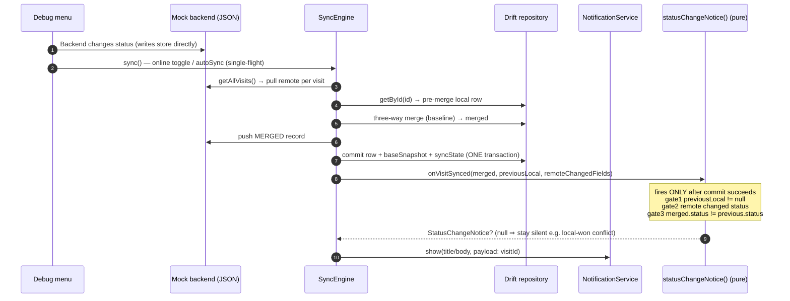

### 8.2 Routing — two sources, one router, one redirect

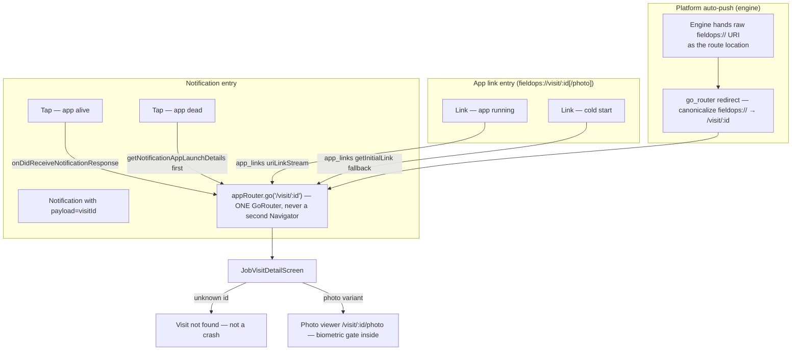

Cold-start priority is a real if/else — notification launch details first,
`app_links` initial URI second, else stay put — so the two sources can never
double-navigate. The redirect in the middle exists because the platform's own
deep-link pipeline hands go_router the **raw scheme URI** (`defaultRouteName`),
which matches no route and previously produced go_router's "Page Not Found" page
on warm links; canonicalizing it keeps every entry path landing on the same detail
screen.

### 8.3 Files

| File                                               | Role                                                                        |
| -------------------------------------------------- | --------------------------------------------------------------------------- |
| `core/router/app_router.dart`                      | `redirect` canonicalizing `fieldops://` (the warm-link fix)                 |
| `core/router/deep_link_service.dart`               | primary routing: launch details → initial URI → warm streams                |
| `services/notifications/notification_service.dart` | init/permission/channel/show + `statusChangeNotice()` gates                 |
| `data/remote/sync_engine.dart`                     | `onVisitSynced` observation point after commit                              |
| `presentation/providers/sync_providers.dart`       | engine wiring: gates → notification (toggle + autoSync both)                |
| `main.dart`                                        | init ordering: listener before first frame; cold-start route after `runApp` |

These paths were verified live on an Android emulator: warm + cold deep links,
garbage-id handling, notification emission with correct body, warm tap, and
killed-app cold-start tap all pass; the details are in the README's demo script.

---

## 9. Phases 9–10 — Background location tracking (native, both platforms)

Tracking is started per Job Visit from the detail screen. Everything funnels
through ONE Dart contract (`LocationTrackingService`); Android and iOS each
implement the same message names and payload shapes (identical across
platforms).

### 9.1 The tick pipeline — where a GPS fix becomes a trail point

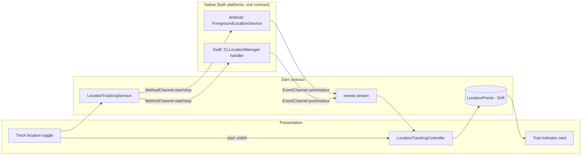

**The rule that holds the merge together:** the native side only CAPTURES. It
never writes to `JobVisits` — persistence to `LocationPoints` happens in the
Dart controller, so background ticks can never change `gpsUpdatedAt` and pollute
a merge. Verified at DB level: 8 ticks landed while `gps_updated_at` stayed
equal to `created_at`.

### 9.2 Android — permission flow (the two-step, Google-mandated order)

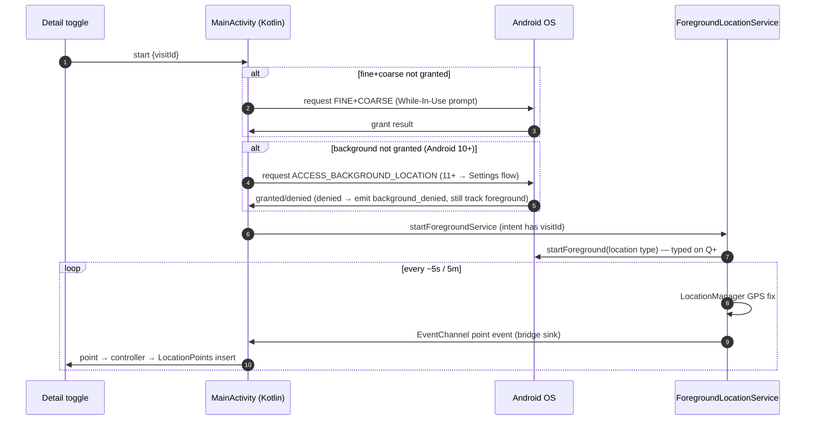

### 9.3 The crash that live testing caught (and the fix)

`START_STICKY` lets the OS auto-restart the service with a NULL intent after
process death — calling `startForeground()` for a location-type FGS from that
background restart throws `SecurityException` (Android 12+ background FGS-start
restriction) and crashed the whole process on reinstall. Fix: null-intent guard
→ `stopSelf()`, unconditional `START_NOT_STICKY`, and `try/catch` around
`startForeground` so any failure degrades to stopped instead of a crash. Strong
README edge-case candidate.

### 9.4 iOS — the authorization matrix (Phase 10)

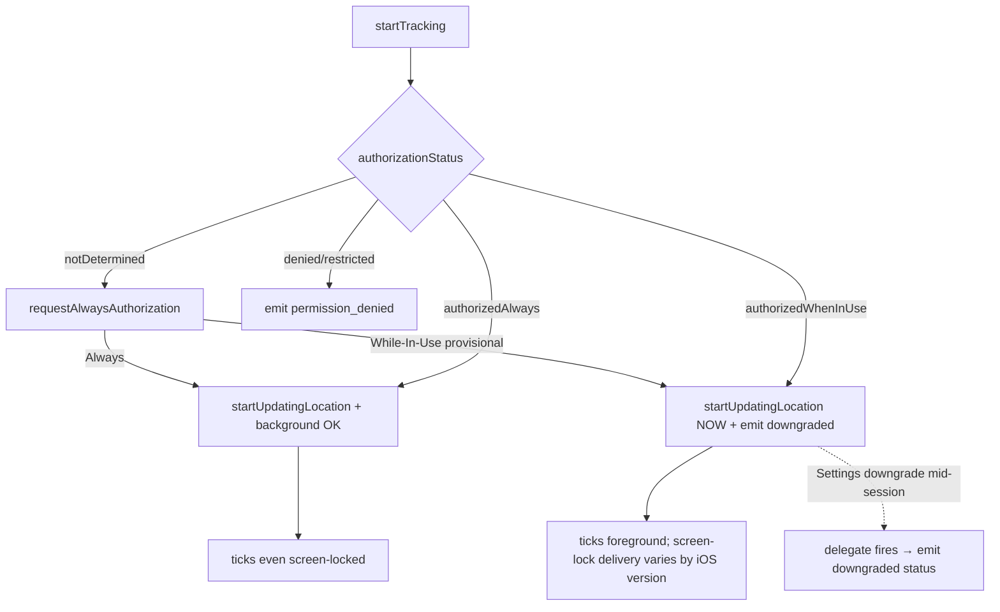

Phase 10 status is honestly coded-but-unbuilt in this environment (no Mac
toolchain). Verification runbook, honest status table, and the shared-Dart
Android evidence are in the README's demo script and "Status at a glance".